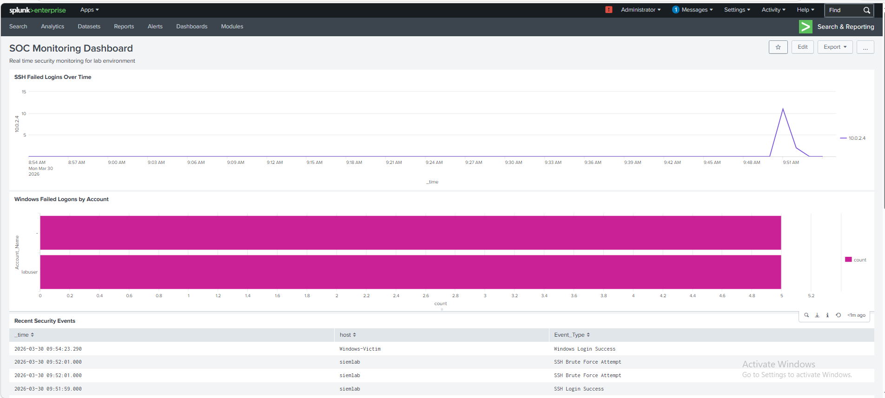
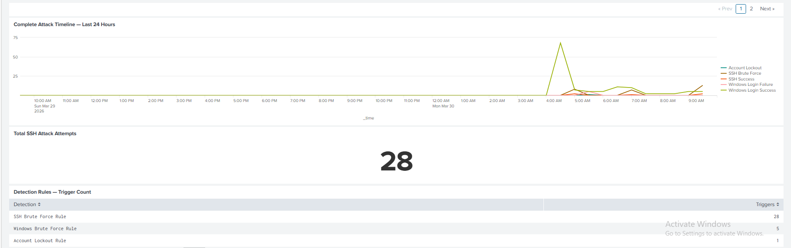
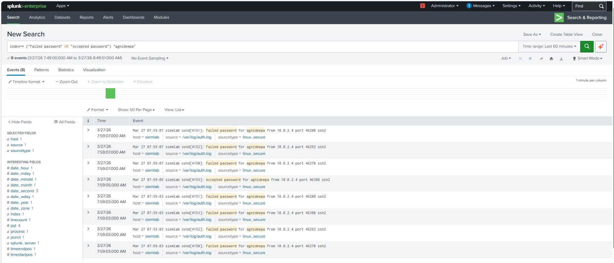
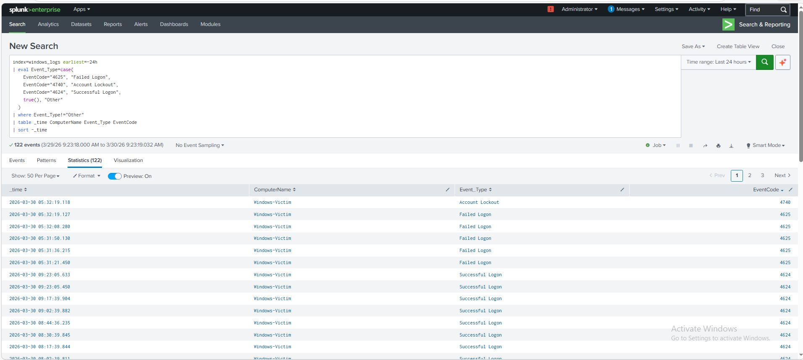
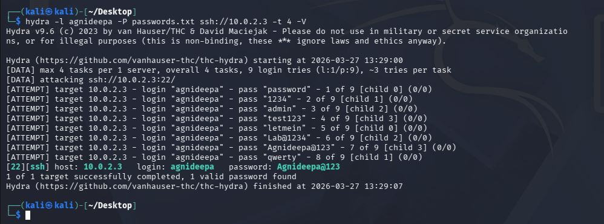
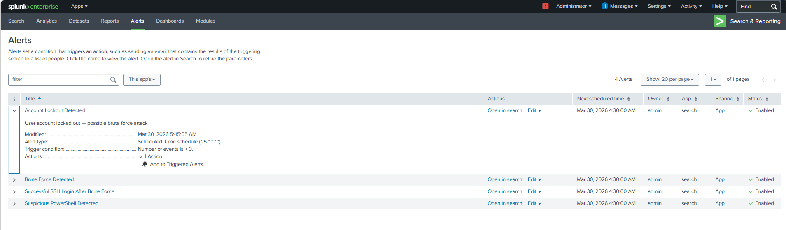
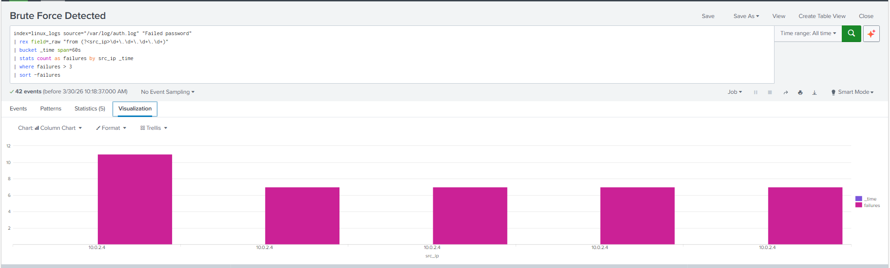
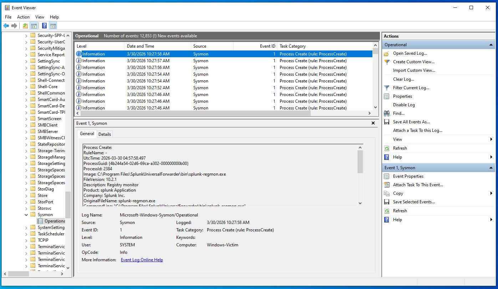

<div align="center">

# 🛡️ SIEM Log Monitoring & Threat Detection Lab


**A fully functional enterprise-grade SOC home lab simulating 
real-world Tier 1 and Tier 2 analyst workflows**

[View Detection Rules](#detection-rules) •
[View Screenshots](#screenshots) •
[View MITRE Mapping](#mitre-attck-mapping)

</div>

---

## 📋 Project Overview

Built a complete multi-VM cybersecurity home lab that simulates a 
real enterprise SOC environment. The lab ingests logs from Windows 
and Linux endpoints into Splunk SIEM, simulates real-world attacks 
using industry standard tools, and detects them using custom 
engineered SPL detection rules — mirroring the exact workflow of 
a Tier 1 and Tier 2 SOC analyst.

---

## 🏗️ Lab Architecture
```
┌─────────────────────────────────────────────────────────────┐
│                    ISOLATED LAB NETWORK                      │
│                   VirtualBox NAT Network                     │
│                                                             │
│  ┌──────────────┐    ┌──────────────┐    ┌──────────────┐  │
│  │  Windows 10  │    │  Kali Linux  │    │Ubuntu Server │  │
│  │   Victim     │    │   Attacker   │    │  SIEM Node   │  │
│  │  10.0.2.x    │    │  10.0.2.4    │    │  10.0.2.3    │  │
│  │              │    │              │    │              │  │
│  │ • Sysmon     │    │ • Hydra      │    │ • Splunk     │  │
│  │ • Splunk UF  │    │ • Nmap       │    │   10.2.1     │  │
│  │ • Win Logs   │    │ • Netcat     │    │              │  │
│  └──────┬───────┘    └──────┬───────┘    └──────┬───────┘  │
│         │                  │ Attacks            │           │
│         └──────────────────┼────────────────────┘           │
│                    Logs via port 9997                        │
└─────────────────────────────────────────────────────────────┘
```

---

## 🛠️ Tools & Technologies

| Category | Tool | Version | Purpose |
|---|---|---|---|
| SIEM | Splunk Enterprise | 10.2.1 | Log aggregation, search, alerting |
| Endpoint Monitoring | Sysmon | Latest | Deep Windows telemetry |
| Sysmon Config | SwiftOnSecurity | Latest | Community detection ruleset |
| Log Forwarding | Splunk Universal Forwarder | 10.2.1 | Agent based log shipping |
| Attack Platform | Kali Linux | 2024 | Adversary simulation |
| Brute Force | Hydra | 9.6 | Credential attack simulation |
| Reconnaissance | Nmap | 7.94 | Network scanning simulation |
| Hypervisor | Oracle VirtualBox | 7.2.6 | VM management |
| SIEM OS | Ubuntu Server | 22.04 LTS | Splunk host |
| Victim OS | Windows 10 | 22H2 | Target endpoint |

---

## ⚔️ Attacks Simulated

### 1. SSH Brute Force Attack
- **Tool used:** Hydra v9.6
- **Target:** Ubuntu SSH service (port 22)
- **Method:** Dictionary attack using custom wordlist
- **Result:** Successfully cracked credentials in under 10 seconds
- **Logs generated:** /var/log/auth.log — Failed/Accepted password events
- **MITRE ATT&CK:** T1110.001 — Brute Force: Password Guessing

### 2. Windows Credential Brute Force
- **Tool used:** net use command simulation
- **Target:** Windows SMB service (port 445)
- **Method:** Multiple failed authentication attempts
- **Result:** Triggered account lockout after threshold exceeded
- **Logs generated:** Event ID 4625 (Failed Logon), Event ID 4740 (Account Lockout)
- **MITRE ATT&CK:** T1110 — Brute Force

### 3. Network Reconnaissance
- **Tool used:** Nmap 7.94
- **Target:** Windows victim machine
- **Method:** SYN scan against all ports
- **Result:** Identified open ports 135, 139, 445
- **Logs generated:** Sysmon Event ID 3 — Network Connections
- **MITRE ATT&CK:** T1046 — Network Service Discovery

### 4. Suspicious PowerShell Execution
- **Tool used:** PowerShell (built in)
- **Target:** Windows victim machine
- **Method:** Base64 encoded command execution and download cradle simulation
- **Logs generated:** Sysmon Event ID 1 — Process Create with encoded CommandLine
- **MITRE ATT&CK:** T1059.001 — Command and Scripting Interpreter: PowerShell

---

## 🔍 Detection Rules

### Rule 1 — SSH Brute Force Detection
**Severity:** 🔴 High
**Trigger:** More than 3 failed SSH attempts from same IP within 60 seconds
```spl
index=linux_logs source="/var/log/auth.log" "Failed password"
| rex field=_raw "from (?<src_ip>\d+\.\d+\.\d+\.\d+)"
| bucket _time span=60s
| stats count as failures by src_ip _time
| where failures > 3
| sort -failures
```

---

### Rule 2 — Successful Login After Brute Force
**Severity:** 🔴 Critical
**Trigger:** Any successful SSH authentication — indicates possible compromise
```spl
index=linux_logs source="/var/log/auth.log" "Accepted password"
| rex field=_raw "from (?<src_ip>\d+\.\d+\.\d+\.\d+)"
| table _time src_ip host
| sort -_time
```

---

### Rule 3 — Windows Account Lockout
**Severity:** 🔴 Critical
**Trigger:** Any account lockout event — strong indicator of automated attack
```spl
index=windows_logs EventCode=4740
| table _time ComputerName Account_Name
| sort -_time
```

---

### Rule 4 — Windows Brute Force Detection
**Severity:** 🟠 High
**Trigger:** More than 5 failed Windows logons for same account
```spl
index=windows_logs EventCode=4625
| stats count as failures by Account_Name
| where failures > 5
| sort -failures
| table Account_Name failures
```

---

### Rule 5 — Suspicious PowerShell Execution
**Severity:** 🟠 High
**Trigger:** PowerShell executed with encoded commands or download cradle
```spl
index=windows_logs EventCode=1
| search CommandLine="*-EncodedCommand*" 
    OR CommandLine="*-enc*" 
    OR CommandLine="*IEX*" 
    OR CommandLine="*DownloadString*"
| table _time ComputerName User CommandLine
| sort -_time
```

---

## 🗺️ MITRE ATT&CK Mapping

| Tactic | Technique ID | Technique Name | Detection Rule |
|---|---|---|---|
| Reconnaissance | T1046 | Network Service Discovery | Nmap Detection |
| Credential Access | T1110 | Brute Force | Windows Brute Force Rule |
| Credential Access | T1110.001 | Password Guessing | SSH Brute Force Rule |
| Persistence | T1078 | Valid Accounts | Successful Login Rule |
| Defense Evasion | T1059.001 | PowerShell | PowerShell Detection Rule |
| Impact | T1531 | Account Access Removal | Account Lockout Rule |

---

## 📊 Key Findings

| Finding | Detail |
|---|---|
| SSH credentials cracked | In under 10 seconds using 9 password attempts |
| Total attack events captured | 57+ Windows security events |
| Failed SSH attempts detected | 7 attempts from single source IP |
| Account lockout triggered | After 5 failed Windows logon attempts |
| Detection rule coverage | 5 rules covering 6 MITRE techniques |
| Alert response time | Every 5 minutes via scheduled Splunk alerts |

---

## 📸 Screenshots

### SOC Monitoring Dashboard



### SSH Brute Force Attack Detected in Splunk


### Windows Security Events — Failed Logons and Account Lockout


### Hydra Brute Force Attack Running from Kali


### Splunk Detection Alerts — All 5 Rules Active



### Sysmon Operational Logs in Windows Event Viewer


---

## 🎯 Skills Demonstrated
```
Security Operations          Detection Engineering
├── SIEM Administration      ├── SPL Query Writing  
├── Log Analysis             ├── Alert Configuration
├── Alert Triage            ├── Threshold Tuning
├── Incident Investigation   └── MITRE ATT&CK Mapping
└── Dashboard Creation       
                             
Attack Simulation            System Administration
├── Credential Attacks       ├── Linux Administration
├── Network Reconnaissance   ├── Windows Event Logging
├── PowerShell Attacks       ├── VM Management
└── Living Off The Land      └── Network Configuration
```

---

## 📚 What I Learned

- How enterprise SIEM pipelines work from endpoint to dashboard
- The difference between raw Windows logs and Sysmon enhanced telemetry
- How attackers use brute force and why speed signatures reveal automation
- How to write SPL detection logic that minimizes false positives
- How MITRE ATT&CK framework maps to real observable events
- The complete SOC analyst workflow from alert to investigation

---

## 🔮 Future Improvements

- [ ] Add Elastic SIEM as alternative to Splunk
- [ ] Implement Sigma rules for cross-platform detection
- [ ] Add Atomic Red Team for automated attack simulation
- [ ] Build Python script to auto-generate Splunk alerts via REST API
- [ ] Add threat intelligence feed integration
- [ ] Implement SOAR playbook for automated response

---

## 📬 Connect With Me

[](https://linkedin.com/in/agnideepa-majumder)
[](https://github.com/agnideepa12)

---

<div align="center">

**⭐ If you found this project helpful please star it!**

*Built as part of a hands-on cybersecurity home lab to develop 
real SOC analyst skills*

</div>
